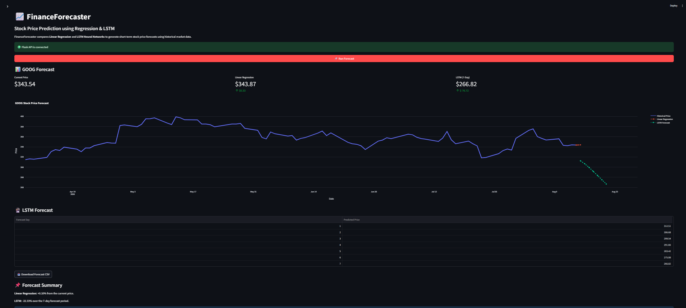
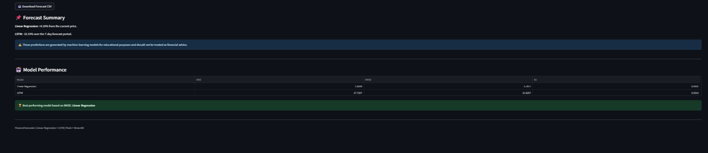

# 📈 FinanceForecaster

### Stock Price Prediction using Linear Regression and LSTM

FinanceForecaster is a machine learning-based stock forecasting application that analyzes historical market data and compares two prediction approaches: **Linear Regression** and **LSTM Neural Networks**.

The project combines a machine learning pipeline, Flask REST API, and Streamlit dashboard to provide an interactive stock forecasting experience.

---

## 🎯 Project Objective

The objective of FinanceForecaster is to explore and compare traditional machine learning and deep learning approaches for short-term stock price forecasting using historical market data.

The project evaluates both models using:

- Mean Absolute Error (MAE)
- Root Mean Squared Error (RMSE)
- R² Score

---

## 📸 Application Preview

### Model Performance

---

## 🚀 Features

- 📊 Historical stock price visualization
- 🤖 Linear Regression prediction
- 🧠 LSTM-based forecasting
- 📈 Model performance comparison
- 📉 MAE, RMSE and R² evaluation
- 🔮 1–30 day LSTM forecasting
- 📥 Forecast CSV download
- 🌐 Flask REST API
- 🖥️ Interactive Streamlit dashboard
- 🔎 Support for multiple stock symbols
- ⚠️ Error handling for unavailable market data

---

## 🏗️ System Architecture

                 Yahoo Finance
                       │
                       ▼
                Historical Data
                       │
                       ▼
              Feature Engineering
                       │
             ┌─────────┴─────────┐
             │                   │
             ▼                   ▼
     Linear Regression          LSTM
             │                   │
             └─────────┬─────────┘
                       ▼
                Model Evaluation
                       │
                 MAE / RMSE / R²
                       │
                       ▼
                  Flask API
                       │
                       ▼
              Streamlit Dashboard
